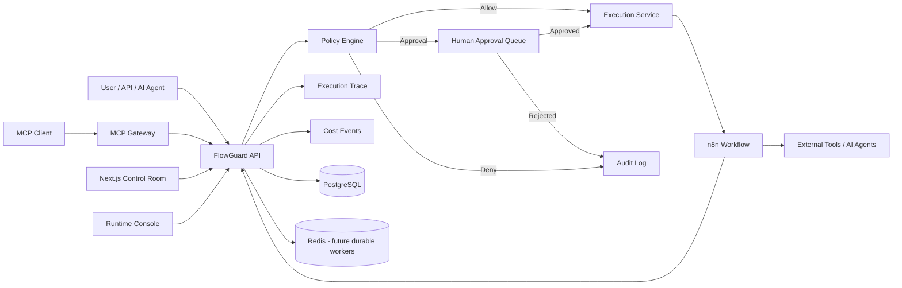

# FlowGuard — Agentic Automation Control Plane

> A production-oriented control layer for **n8n workflows and AI agents** with policy enforcement, human approvals, MCP tools, retry/replay lineage, cost tracking and execution observability.

FlowGuard is not another workflow builder. It sits **in front of n8n and agentic automations** and decides what may execute automatically, what must wait for human approval, and what must be denied.

## Why FlowGuard?

Traditional automation often looks like:

`Trigger → Workflow → Action`

FlowGuard adds the missing control layer:

`Request → Policy Engine → Approval Gate → n8n / Agent → Trace + Cost + Audit`

The goal is to make AI-powered automation safer and easier to operate when workflows can send messages, update records, spend money, call APIs or invoke autonomous agents.

## V0.2 capabilities

### Guarded execution
- Workflow Registry for n8n automations
- Risk levels: low, medium, high, critical
- Policy Engine with allow / require approval / deny decisions
- Human-in-the-loop approval queue
- Dry-run mode before external execution
- n8n webhook execution adapter
- Immutable-style audit events

### Agentic runtime
- **MCP Gateway** at `POST /mcp`
- MCP tool: `flowguard.list_workflows`
- MCP tool: `flowguard.request_execution`
- MCP tool: `flowguard.execution_trace`
- MCP requests use the same policy and approval path as dashboard requests

### Reliability and observability
- Retry failed executions
- Safe replay with dry-run default
- Retry/replay lineage graph data
- Per-execution execution trace
- AI/API cost events with provider, model and token counts
- Actual cost aggregation beside estimated cost
- Runtime console at `/runtime`

### n8n integration
- Manual workflow registration
- n8n API synchronization
- Automatic discovery of workflows containing Webhook nodes
- Stable `n8n-<workflow-id>` registry slugs
- Import/update/skip sync reporting

### Platform
- Next.js dashboard
- FastAPI control API
- PostgreSQL
- Redis-ready architecture
- Docker Compose local stack
- Example guarded n8n workflow
- GitHub Actions CI for API and frontend

## Architecture



## Stack

- **Dashboard:** Next.js + TypeScript
- **Control API:** FastAPI + SQLAlchemy
- **Database:** PostgreSQL
- **Automation runtime:** n8n
- **Cache / future queue:** Redis
- **Local orchestration:** Docker Compose

## Quick start

```bash
git clone https://github.com/ahmed2qaid/agentic-automation-control-plane.git
cd agentic-automation-control-plane
cp .env.example .env
docker compose up --build -d
```

Open:

- Control Room: http://localhost:3000
- Runtime / Trace Console: http://localhost:3000/runtime
- FlowGuard API docs: http://localhost:8000/docs
- MCP endpoint: http://localhost:8000/mcp
- n8n: http://localhost:5678

Import the example workflow:

```bash
docker compose exec n8n n8n import:workflow --input=/workflows/guarded-action.json
```

Then activate **FlowGuard - Guarded Action Demo** in n8n.

## Configure n8n workflow sync

FlowGuard uses the n8n public API to discover workflows with Webhook nodes.

1. Open n8n and create an API key.
2. Put it in `.env`:

```env
N8N_API_URL=http://n8n:5678
N8N_PUBLIC_URL=http://n8n:5678
N8N_API_KEY=your-n8n-api-key
```

3. Synchronize:

```bash
curl -X POST http://localhost:8000/api/workflows/sync/n8n
```

FlowGuard imports new webhook workflows, updates known workflows, and leaves unchanged workflows untouched. Risk defaults to `medium` for newly synchronized workflows so policy remains owned by FlowGuard rather than n8n payloads.

## Example guarded execution

```bash
curl -X POST http://localhost:8000/api/executions \
  -H 'Content-Type: application/json' \
  -d '{
    "workflow_id": "<workflow-id>",
    "input": {"recipient":"demo@example.com","subject":"Hello"},
    "estimated_cost_usd": 0.02,
    "dry_run": true,
    "requested_by": "local-demo"
  }'
```

Policy defaults:

- **low / medium** → automatic execution
- **high** → human approval required
- **critical** → denied
- estimated cost above `MAX_AUTO_COST_USD` → human approval required
- `dry_run=true` → evaluate and record, but never call n8n

## Retry and replay

Retry is restricted to failed executions and re-enters the policy engine:

```bash
curl -X POST http://localhost:8000/api/executions/<execution-id>/retry \
  -H 'Content-Type: application/json' \
  -d '{"requested_by":"operator"}'
```

Replay creates a new related execution and defaults to **dry-run** so historical inputs are not repeated as side effects accidentally:

```bash
curl -X POST http://localhost:8000/api/executions/<execution-id>/replay \
  -H 'Content-Type: application/json' \
  -d '{"requested_by":"operator"}'
```

Inspect the complete lineage and runtime trace:

```bash
curl http://localhost:8000/api/executions/<execution-id>/trace
```

## Record actual AI cost

Workers, n8n nodes or agent adapters can report real usage after a provider call:

```bash
curl -X POST http://localhost:8000/api/executions/<execution-id>/costs \
  -H 'Content-Type: application/json' \
  -H 'X-FlowGuard-Secret: change-me-in-production' \
  -d '{
    "provider":"openai",
    "model":"example-model",
    "input_tokens":1200,
    "output_tokens":300,
    "cost_usd":0.0134,
    "metadata":{"step":"summarize"}
  }'
```

The Runtime Console compares estimated cost with accumulated actual cost and displays each provider/model event.

## MCP Gateway

The `/mcp` endpoint implements the core JSON-RPC flow needed for a tool-oriented MCP client: `initialize`, `tools/list`, and `tools/call`.

List tools:

```bash
curl -X POST http://localhost:8000/mcp \
  -H 'Content-Type: application/json' \
  -d '{"jsonrpc":"2.0","id":1,"method":"tools/list","params":{}}'
```

Request a guarded execution through MCP:

```json
{
  "jsonrpc": "2.0",
  "id": 2,
  "method": "tools/call",
  "params": {
    "name": "flowguard.request_execution",
    "arguments": {
      "workflow_id": "<workflow-id>",
      "input": {"task": "prepare operations report"},
      "estimated_cost_usd": 0.03,
      "dry_run": true,
      "requested_by": "agent-demo"
    }
  }
}
```

The MCP gateway intentionally does **not** bypass policy. A high-risk request still becomes a pending approval and a critical request is still denied.

## Upgrade design

V0.2 does not alter existing V0.1 `executions` columns. New capabilities use additive tables:

- `execution_relations`
- `cost_events`

This keeps existing local/PostgreSQL installations compatible with the current `Base.metadata.create_all()` bootstrap.

## Repository layout

```text
apps/
  api/                 FastAPI control plane + MCP gateway
  web/                 Next.js control room + runtime trace console
infra/
  postgres/            database bootstrap
n8n/
  workflows/           importable example workflows
docs/
  ARCHITECTURE.md
  SECURITY.md
```

## Roadmap

- Signed MCP/client authentication and scopes
- Durable Redis worker queue + dead-letter queue
- Provider adapters that calculate token cost automatically
- OpenTelemetry traces and metrics
- Role-based and multi-stage approvals
- Multi-tenant workspaces
- Workflow version diffing during n8n sync
- GitHub / Slack / email approval channels

## Security note

V0.2 still uses a shared secret for n8n callback/cost ingestion in local-first deployments. For production, use signed requests, secret rotation, private networking, least-privilege n8n credentials, MCP client authentication and the controls described in [`docs/SECURITY.md`](docs/SECURITY.md).

## License

MIT
