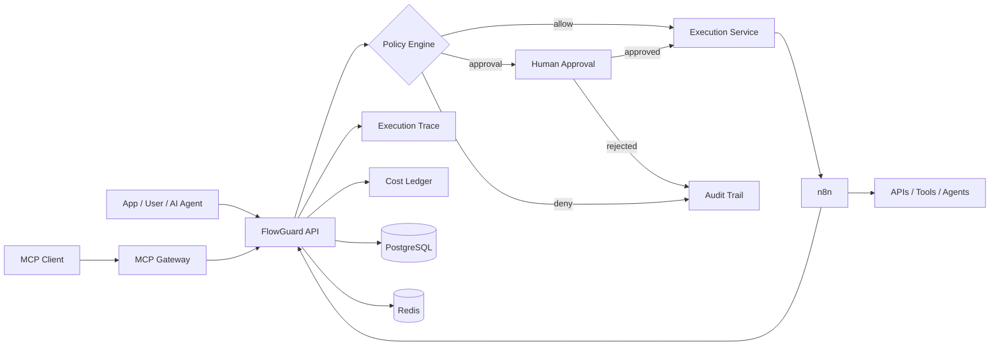

<div align="center">

# 🛡️ FlowGuard

### Agentic Automation Control Plane

**Put policy, approvals, cost guardrails and observability in front of n8n workflows and AI agents.**

[](https://github.com/ahmed2qaid/agentic-automation-control-plane/actions/workflows/ci.yml)


`n8n` · `AI Agents` · `MCP` · `FastAPI` · `Next.js` · `PostgreSQL` · `Docker`

</div>

---

## The problem

Modern automation can do much more than move data between apps. An AI agent or workflow can send messages, mutate records, call paid APIs, spend tokens, or trigger another autonomous system.

A direct automation path is simple, but it gives the runtime too much authority:

```text
Trigger → Agent / Workflow → External Action
```

FlowGuard inserts an explicit control plane before side effects:

```text
Request → Policy → Approval → Execution → Trace → Cost → Audit
```

It is **not another workflow builder**. n8n remains the automation runtime; FlowGuard owns the decision about whether execution is allowed.

## Why this is different from an n8n workflow collection

| Concern | Plain workflow | FlowGuard |
| --- | --- | --- |
| Risk policy | Embedded or manual | Central policy engine |
| Human approval | Workflow-specific | Durable approval gate |
| AI agent access | Direct tool/webhook access | Guarded MCP gateway |
| Testing | Usually triggers the workflow | First-class dry-run |
| Failure recovery | Manual / workflow-specific | Retry + safe replay lineage |
| Cost visibility | External / ad hoc | Estimated + actual provider cost |
| Auditability | Runtime logs | Control-plane audit trail |
| n8n discovery | Manual | Workflow registry sync |

## What ships in v0.2

**Guarded execution** — workflow registry, `low / medium / high / critical` risk levels, deterministic policy evaluation, human approvals, deny rules and dry-runs.

**Agentic runtime** — MCP tools for workflow discovery, guarded execution requests and execution-trace inspection. MCP requests pass through the same policy path as REST and dashboard requests.

**Reliability** — failed execution retry, replay with dry-run as the safe default, and durable retry/replay lineage instead of overwriting history.

**Observability** — execution trace, audit events, provider/model token usage and actual-cost events compared with the original estimate.

**n8n integration** — webhook execution adapter plus n8n API synchronization that discovers workflows containing Webhook nodes.

**Operator UI** — Next.js Control Room for approvals/policies/executions and a Runtime Console for traces, costs and lineage.

## Architecture



The key design rule is simple: **the agent never grants itself authority.** Risk, budget and approval policy live outside prompts and n8n payloads.

## A real demo scenario

Imagine an AI agent receives:

> Send a customer update to the production mailing workflow.

The agent calls FlowGuard through MCP instead of calling n8n directly.

```text
AI Agent
  ↓
flowguard.request_execution
  ↓
Workflow = high risk
  ↓
Policy Engine → require_approval
  ↓
Human approves in Control Room
  ↓
n8n webhook executes
  ↓
FlowGuard records result + actual cost + audit trace
```

If the execution fails, an operator can **Retry** it. If an old execution must be reproduced, **Replay** creates a new related execution and defaults to dry-run so the original side effect is not silently repeated.

See [`docs/DEMO.md`](docs/DEMO.md) for the complete walkthrough.

## 5-minute local start

Prerequisite: Docker + Docker Compose.

```bash
git clone https://github.com/ahmed2qaid/agentic-automation-control-plane.git
cd agentic-automation-control-plane
cp .env.example .env
docker compose up --build -d
```

Then import the guarded n8n example:

```bash
docker compose exec n8n n8n import:workflow --input=/workflows/guarded-action.json
```

Open these local services:

| Service | Address |
| --- | --- |
| FlowGuard Control Room | `http://localhost:3000` |
| Runtime / Trace Console | `http://localhost:3000/runtime` |
| FastAPI docs | `http://localhost:8000/docs` |
| MCP endpoint | `http://localhost:8000/mcp` |
| n8n | `http://localhost:5678` |

Activate **FlowGuard - Guarded Action Demo** in n8n before testing a real execution.

## Policy defaults

| Condition | Decision |
| --- | --- |
| Dry-run requested | `dry_run` — never calls n8n |
| Low / medium risk | `allow` |
| High risk | `require_approval` |
| Critical risk | `deny` |
| Cost above `MAX_AUTO_COST_USD` | `require_approval` |

Persisted policies are priority ordered, so product-specific rules can override the conservative defaults.

## MCP surface

Current tools:

```text
flowguard.list_workflows
flowguard.request_execution
flowguard.execution_trace
```

Example discovery request:

```bash
curl -X POST http://localhost:8000/mcp \
  -H 'Content-Type: application/json' \
  -d '{"jsonrpc":"2.0","id":1,"method":"tools/list","params":{}}'
```

An MCP execution request intentionally **cannot bypass** policy or approval requirements.

## n8n registry sync

Add an n8n API key to `.env`:

```env
N8N_API_URL=http://n8n:5678
N8N_PUBLIC_URL=http://n8n:5678
N8N_API_KEY=your-n8n-api-key
```

Then synchronize:

```bash
curl -X POST http://localhost:8000/api/workflows/sync/n8n
```

FlowGuard discovers n8n workflows with Webhook nodes and maps them into the registry. Newly discovered workflows default to `medium` risk so trust is assigned by FlowGuard, not by workflow input.

## Execution trace and cost ledger

Fetch the complete execution trace:

```bash
curl http://localhost:8000/api/executions/<execution-id>/trace
```

A trace combines independently persisted records:

```text
Execution
├── Audit events
├── Cost events
└── Retry / replay relations
```

Provider adapters or n8n steps can report actual usage after an AI/API call. FlowGuard keeps the original estimated cost separate from the accumulated actual cost.

## Retry and safe replay

Retry a failed run:

```bash
curl -X POST http://localhost:8000/api/executions/<execution-id>/retry \
  -H 'Content-Type: application/json' \
  -d '{"requested_by":"operator"}'
```

Replay a historical run:

```bash
curl -X POST http://localhost:8000/api/executions/<execution-id>/replay \
  -H 'Content-Type: application/json' \
  -d '{"requested_by":"operator"}'
```

Replay defaults to **dry-run**, and both retry and replay re-enter policy evaluation.

## Repository map

```text
apps/
├── api/          FastAPI control plane + MCP gateway
└── web/          Next.js Control Room + Runtime Console

n8n/
└── workflows/    Importable guarded workflow example

infra/
└── postgres/     Database bootstrap

docs/
├── ARCHITECTURE.md
├── SECURITY.md
└── DEMO.md
```

## Stack

| Layer | Technology |
| --- | --- |
| Control API | FastAPI, Python, SQLAlchemy |
| Operator UI | Next.js, TypeScript |
| Automation runtime | n8n |
| Persistence | PostgreSQL |
| Queue/cache foundation | Redis |
| Agent protocol | MCP / JSON-RPC |
| Local deployment | Docker Compose |
| Quality gate | Ruff, Pytest, Next.js production build |

## Current status

**v0.2.0 — functional reference implementation**

GitHub Actions validates both sides of the project on every push: API lint/tests and the production Next.js build.

FlowGuard is currently local/private-network oriented. Read [`docs/SECURITY.md`](docs/SECURITY.md) before exposing any control-plane endpoint publicly.

## Roadmap to production hardening

- Durable Redis-backed execution workers + Dead Letter Queue
- Idempotency and callback replay protection
- Authenticated MCP sessions and per-tool scopes
- Automatic provider token/cost adapters
- RBAC and multi-stage approvals
- OpenTelemetry traces and metrics
- Multi-tenant workspace boundaries
- n8n workflow version diffing

## Contributing

Issues, architecture discussions and focused pull requests are welcome. Start with [`CONTRIBUTING.md`](CONTRIBUTING.md).

## Documentation

- [Architecture](docs/ARCHITECTURE.md)
- [Security model](docs/SECURITY.md)
- [End-to-end demo](docs/DEMO.md)
- [Changelog](CHANGELOG.md)

## License

MIT
