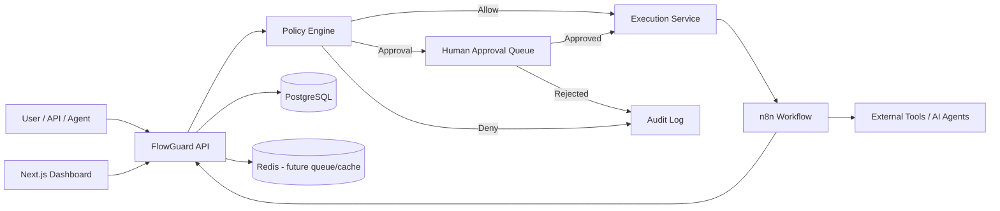

# FlowGuard — Agentic Automation Control Plane

> Production-oriented control plane for **n8n workflows and AI agents** with policy-based execution, human approvals, dry-runs, audit logs, cost controls, and execution observability.

FlowGuard is not another workflow builder. It sits **in front of n8n and agentic automations** and decides what may execute automatically, what must wait for human approval, and what must be denied.

## Why FlowGuard?

Traditional automation often looks like:

`Trigger → Workflow → Action`

FlowGuard adds the missing control layer:

`Request → Policy Engine → Approval Gate → n8n / Agent → Verification → Audit Log`

This makes automation safer to operate in real systems where actions can send messages, update records, spend money, call APIs, or trigger AI agents.

## V0.1 capabilities

- Workflow Registry for n8n automations
- Risk levels: low, medium, high, critical
- Policy Engine with allow / require approval / deny decisions
- Human-in-the-loop approval queue
- Dry-run mode before external execution
- n8n webhook execution adapter
- Execution history and statuses
- Immutable-style audit events
- Cost estimate guardrail
- Webhook event ingestion from n8n
- Dashboard for workflows, approvals, executions, and health
- Docker Compose local stack
- PostgreSQL + Redis-ready architecture
- Example guarded n8n workflow
- CI for frontend and API

## Architecture



## Stack

- **Dashboard:** Next.js + TypeScript
- **Control API:** FastAPI + SQLAlchemy
- **Database:** PostgreSQL
- **Automation runtime:** n8n
- **Cache / future queue:** Redis
- **Local orchestration:** Docker Compose

## Quick start

```bash
git clone https://github.com/ahmed2qaid/agentic-automation-control-plane.git
cd agentic-automation-control-plane
cp .env.example .env
docker compose up --build -d
```

Open:

- Dashboard: http://localhost:3000
- FlowGuard API docs: http://localhost:8000/docs
- n8n: http://localhost:5678

Import the sample n8n workflow:

```bash
docker compose exec n8n n8n import:workflow --input=/workflows/guarded-action.json
```

Then activate **FlowGuard - Guarded Action Demo** in n8n.

## Example execution flow

1. Register an n8n webhook in the Workflow Registry.
2. Send an execution request to FlowGuard.
3. FlowGuard evaluates risk, policies, dry-run mode, and estimated cost.
4. Low-risk work can execute automatically.
5. High-risk work enters the approval queue.
6. Critical work is denied by default.
7. Approved executions call n8n using a shared control-plane secret.
8. Every decision and state transition is recorded in the audit log.

## Example API call

```bash
curl -X POST http://localhost:8000/api/executions \
  -H 'Content-Type: application/json' \
  -d '{
    "workflow_id": "<workflow-id>",
    "input": {"recipient":"demo@example.com","subject":"Hello"},
    "estimated_cost_usd": 0.02,
    "dry_run": true,
    "requested_by": "local-demo"
  }'
```

## Policy defaults

FlowGuard ships with conservative defaults:

- **low / medium** → automatic execution
- **high** → human approval required
- **critical** → denied
- estimated cost above `MAX_AUTO_COST_USD` → human approval required
- `dry_run=true` → evaluate and record, but never call n8n

Policies can also be added through the API and are evaluated by priority.

## Repository layout

```text
apps/
  api/                 FastAPI control plane
  web/                 Next.js dashboard
infra/
  postgres/            database bootstrap
n8n/
  workflows/           importable example workflows
docs/
  ARCHITECTURE.md
  SECURITY.md
```

## Roadmap

- MCP Gateway and tool registry
- Redis/BullMQ or durable queue workers
- LLM provider abstraction and token/cost accounting
- Webhook signatures and replay protection
- Role-based approvals
- Multi-tenant workspaces
- Retry policies and dead-letter queue
- Execution replay from historical inputs
- OpenTelemetry traces and metrics
- n8n workflow synchronization via API
- GitHub / Slack / email approval channels

## Security note

V0.1 uses a shared secret between FlowGuard and n8n for a simple local-first integration. For production, use signed requests, secret rotation, private networking, least-privilege credentials, and the controls described in [`docs/SECURITY.md`](docs/SECURITY.md).

## License

MIT
